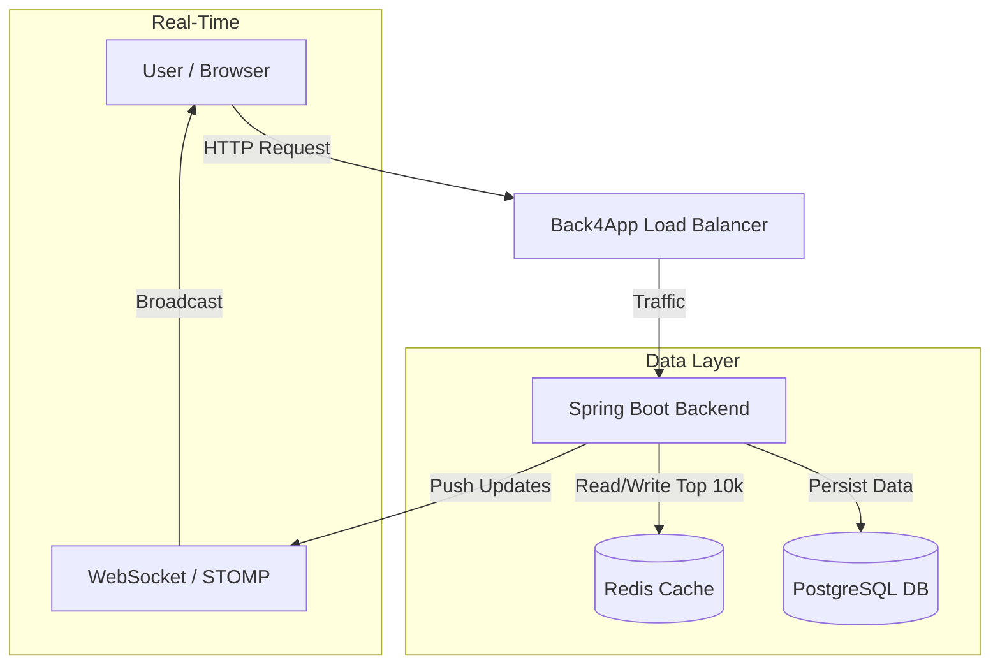
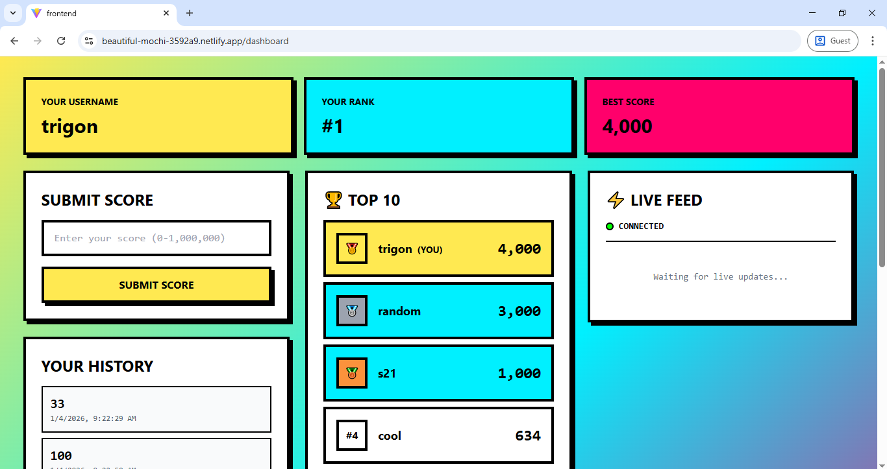

# ⚡ Zenith - Reach the Peak

<div align="center">


**Compete • Climb • Conquer**
**Real-time leaderboard. Top 10,000 players. Only the best survive.**

🌐 **[Live Demo](https://beautiful-mochi-3592a9.netlify.app/)** | 📡 **[API](https://zenith-v5nteqrs.b4a.run)**

[Features](#-features) • [Architecture](#-architecture) • [Database](#-database-design) • [API Docs](#-api-documentation) • [Performance](#-performance-optimization)

</div>

---

## 🚀 Live Application

**🎯 Try it now:** [https://beautiful-mochi-3592a9.netlify.app/](https://beautiful-mochi-3592a9.netlify.app/)

- ⚡ **Real-Time Leaderboard** - Live rank updates powered by Redis and WebSockets.
- 🏆 **Top 10k Elite** - Highly optimized Redis Sorted Sets manage the top 10,000 players for ultra-fast retrieval.
- 📊 **Score History** - Persistent score tracking backed by PostgreSQL.
- 🔒 **Secure Authentication** - JWT-based stateless authentication.
- 🎨 **Vibe-Coded Frontend** - The entire frontend was vibe-coded using **Claude 4.5**. (Zero lines of frontend code manually written!)

---

## ✨ Features

### 🎯 Core Features

**High-Performance Leaderboard**
- **Redis Powered**: The top 10,000 ranks are served directly from Redis for sub-millisecond latency.
- **Postgres Fallback**: While the elite top 10k are cached in Redis, full score histories and persistent data are safely stored in PostgreSQL on Supabase.
- **Real-Time Updates**: WebSocket integration broadcasts score changes instantly to connected clients.

**User Experience**
- **Seamless Auth**: Secure signup and login flow using JWT.
- **Interactive Dashboard**: View your current rank, best score, and submission history.
- **Live Feed**: Watch the competition unfold in real-time.

---

## 🏗️ Architecture

### Application Flow


### 📁 Project Structure
```
Zenith/
├── src/main/java/com/example/Zenith/
│   ├── controller/          # REST API Controllers
│   ├── service/             # Business Logic (Leaderboard, Score, User)
│   ├── repository/          # Data Access Layer (JPA)
│   ├── entity/              # Database Entities (Users, Scores)
│   ├── dto/                 # Data Transfer Objects
│   ├── config/              # Redis, WebSocket, Security Config
│   └── util/                # JWT Utilities
├── frontend/                # React Application
│   ├── src/
│   │   ├── components/      # Reusable UI Components
│   │   ├── pages/           # Application Pages
│   │   ├── hooks/           # Custom React Hooks
│   │   └── api/             # API Client Functions
│   └── public/              # Static Assets
└── README.md                # Project Documentation
```

---

## 📊 Database Design

The application uses a relational database (PostgreSQL) for persistence and an in-memory data store (Redis) for caching the leaderboard.

### Schema (PostgreSQL)

**1. Users Table**
Stores user credentials and profile information.
| Column | Type | Constraints | Description |
|--------|------|-------------|-------------|
| `id` | BIGINT | PK, Auto Increment | Unique user identifier |
| `username` | VARCHAR | UNIQUE, NOT NULL | Public display name |
| `email` | VARCHAR | UNIQUE, NOT NULL | User email address |
| `password` | VARCHAR | NOT NULL | BCrypt hashed password |

**2. Scores Table**
Stores historical score submissions.
| Column | Type | Constraints | Description |
|--------|------|-------------|-------------|
| `id` | BIGINT | PK, Auto Increment | Unique score identifier |
| `score` | BIGINT | NOT NULL | The submitted score value |
| `submitted_at`| TIMESTAMP | | Time of submission |
| `user_id` | BIGINT | FK -> Users.id | Reference to the user |

### Redis Data Structure
- **Key**: `leaderboard:global`
- **Type**: Sorted Set (ZSET)
- **Member**: `username`
- **Score**: `score` value
- **Logic**: Stores only the top 10,000 players. Lower ranked players are removed from Redis to save memory, but their data remains in PostgreSQL.

---

## 📡 API Documentation

### 🔹 Authentication

#### 1. Sign Up
**Endpoint:** `POST /auth/signup`
**Description:** Register a new user.
**Validation:** Username (alphanumeric), Password (min 6 chars), Email (valid format).

**Request Body:**
```json
{
  "userName": "climber123",
  "email": "climber@example.com",
  "password": "password123"
}
```

**Response:** `201 Created`
```
"User created please login"
```
**Error Responses:**
- `400 Bad Request`: "User already exists" or validation error.

#### 2. Log In
**Endpoint:** `POST /auth/login`
**Description:** Authenticate user and receive a JWT token.

**Request Body:**
```json
{
  "email": "climber@example.com",
  "password": "password123"
}
```

**Response:** `200 OK`
```json
{
  "token": "eyJhbGciOiJIUzI1NiIsIn...",
  "email": "climber@example.com",
  "username": "climber123"
}
```

---

### 🔹 Leaderboard

#### 1. Get Top 10
**Endpoint:** `GET /leaderboard/top10`
**Description:** Retrieves the top 10 players from Redis ZSET.

**Response:** `200 OK`
```json
[
  {
    "username": "trigon",
    "score": 4000,
    "rank": 1
  },
  {
    "username": "random",
    "score": 3000,
    "rank": 2
  }
]
```

#### 2. Get User Rank
**Endpoint:** `GET /leaderboard/rank`
**Query Param:** `username` (String)
**Description:** Checks the Redis Top 10k leaderboard for the user's rank.

**Response:** `200 OK`
```json
4
```
*Note: If user is outside top 10k, returns message "User not in top 10,000. Keep playing!"*

#### 3. Get User Score
**Endpoint:** `GET /leaderboard/score`
**Query Param:** `username` (String)
**Description:** Retrieves the user's best score. Checks Redis first; falls back to Postgres if not found.

**Response:** `200 OK`
```json
4000
```

---

### 🔹 Scores

#### 1. Submit Score
**Endpoint:** `POST /score/addscore`
**Headers:** `Authorization: Bearer <token>`
**Description:** Submits a new score. Updates Postgres and, if eligible, the Redis Leaderboard. Triggers WebSocket broadcast.

**Request Body:**
```json
{
  "score": 5000
}
```

**Response:** `201 Created`
```
"score added"
```

#### 2. Get Score History
**Endpoint:** `GET /score/getscores`
**Headers:** `Authorization: Bearer <token>`
**Description:** Retrieves full score history for the authenticated user from PostgreSQL.

**Response:** `200 OK`
```json
[
  {
    "id": 1,
    "score": 4000,
    "submittedAt": "2025-01-04T10:00:00"
  },
  {
    "id": 2,
    "score": 3500,
    "submittedAt": "2025-01-03T09:00:00"
  }
]
```

---

## ⚡ Performance Optimization

### 1️⃣ Current Features
*   **Redis Caching (Top 10k)**: The leaderboard logic is optimized to keep only the top 10,000 players in the Redis In-Memory Sorted Set. This ensures that the most frequently accessed data (the leaderboard) is retrieved with **O(log N)** time complexity.
*   **Postgres Fallback**: Users outside the top 10k are not stored in Redis to save memory. Their data is securely persisted in PostgreSQL, ensuring scalability without exploding memory costs.
*   **Lazy Loading**: The `Scores` entity uses `FetchType.LAZY` for the User relationship to minimize database load when fetching score history.
*   **WebSockets**: Instead of polling the server for leaderboard updates (which is resource-intensive), the server pushes updates to clients in real-time.

### 2️⃣ Future Improvements
*   **Sharding**: As the user base grows beyond millions, the Redis instance can be sharded based on score ranges or user regions to distribute the load.
*   **Read Replicas**: Implementing PostgreSQL read replicas would offload read operations (like fetching history) from the primary write database.
*   **Rate Limiting**: Implementing API rate limiting (e.g., Bucket4j) to prevent abuse of the score submission endpoint.
*   **CDN Integration**: Serving static assets (frontend) via a global CDN for faster load times.

---

## 📸 Screenshots

<div align="center">

### 🏠 Landing Page


*Join the competition and reach the Zenith*

### 🔐 Authentication

| Login | Signup |
|:---:|:---:|
|  |  |
| *Welcome back, climber* | *Start your journey* |

### 📊 Dashboard & Leaderboard


*Live rank, score submission, and history*

</div>

---

## 🎥 Demo

<div align="center">
  <h3>Watch Zenith in Action</h3>
  <!-- Replace with actual demo link or embed -->
  <p><em>Coming Soon...</em></p>
</div>

---

<div align="center">

### ⭐ Star this repo if you found it cool!

**Built with Spring Boot & React • Frontend Vibe-Coded by Claude 4.5**

[⬆ Back to Top](#-zenith---reach-the-peak)

</div>
